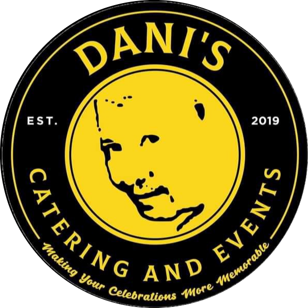

#   Dani's Catering and Events:Web-Based Wedding Supplier System
## Dani's Catering and Events -Service Module

## Introduction

A wedding is one of the important event/occasions that are traditionally celebrated by both families, relatives, friends and otherimportant people for the couple. And in preparations for the wedding the couple usually looking for suppliers that can meet the couples desire and needs for the event. With the help of this system, the user/customer can easily access and browse all the packages and services available for the customer and choose what the customer wants. 

The Dani's Catering and Events manage a lot of events but mainly focus on the wedding. In this project, the proponents proposed a web-based wedding supplier system that allows the company to manage their transaction smoothly and for the customer to easily acquire the services and packages the company offers. On the otherhand, the proponents focus on the service module as it seem to be the core of the system. In the service module there's a lot of functionalities that the user/customer can use to have transaction to the company. 

In the service module there will be a lists of packages for wedding that a customer can acquire and inquire, also there will be a lists of packages for other events like birthday's as the company not only focus on the wedding. In addition, the company allow's customization of the packages and service depending on the customers need and desire for the events. And there will be a downpayment transaction available on the service module to monitor and manage the reservations of the packages that the customer chosen on the specific date they need it. 
 

 It allows the customer to access the system by logging in the account. And for the availing of the services being offered by the company, It will show the customer how many packages and services are available on the company. With that the customer can choose a specific package where the customer can view all he details of the package. After viewing, the customer can choose and decide what to avail there will be reservation form to be filled up and receipt of the packages or service choosen. With that the customer can pay a down payment to have a propper reservation. 
 

## SDG
 The SDG's that the project is aims to attain the Decent Work and Economic Growth and the SDG will further explain:
 ### Goal 8: Decent Work and Economic Growth
    
 https://sdg.neda.gov.ph/goal-8/  

 Dani's Catering and Events not only focus on supplying the wedding bt it offers other packages on the different kinds/type of events. The system is design and develop a web-based wedding supplier system for Dani's Catering and Events to evaluate the system in terms of user acceptability, effectiveness, quality, productivity and dependability and to provide a feature that allows the users to customize the package depending on the things needed on the wedding. With the help of the system, the target user could have knowledge and understanding of the possible costs that may add to the transactions. 

  

 We’re going to start from the login. It requires the customer to login first before they can access the data inside. It requires you to fill up the fields of username and password in order to login. Next, after you login. You can now browse the system, on the other hand, the other modules are  under construction as we focus on the service module. Under the service module, it allows the user to view and see all the packages/services available on the company. They can choose based on the categories of events that the company caters. After choosing the categories, the system will display all the packages and services under these categories. Upon viewing the packages it allows the customer to choose by selecting it. After selecting the package that the customer wants, the system will generate the package receipt and the reservation form to be filled up by the customer. 

 
